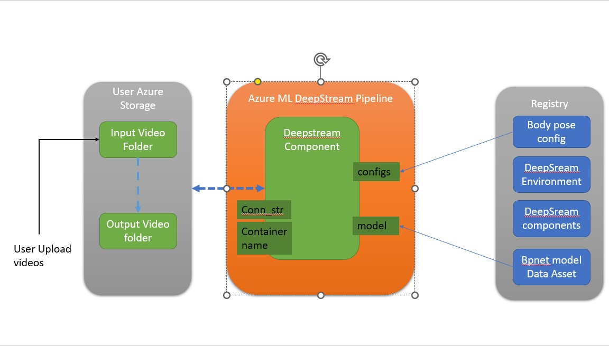

# DeepStream component for Azure ML

All DeepStream components for Azure ML share the following commonalities

* They all based on deepstream container.
* They all monitor/process videos in Azure storage blob as interface with end user
  * inputs - need to have a folder called inputs as video queue, every processed video will be deleted from this folder. Currently supported extension are .mp4 and .mov
  * outputs - need to have a folder called outputs.  every output will be there with timestamp in file name.  The output file extension are .264.  
  * the.end - The component will keep monitor the Azure storage blob forever until it detect any file with extension .end.
* They all expect the following inputs
  *  configs and model provide as example, expect to pass in from pipeline.  fine tune model from TAO can improve the accuracy and performance dramically.
  *  connecting string and container name for the Azure storage blob to work on

## prerequisites

Deepstream require hardware decode/encode.  Please make sure the GPU has it.  in otherword, V100, A100, H100 not work.  Please choose T4, A2, A40, L4, L40, etc.

## DeepStream component for Azure ML architecture

The following diagram provides a high-level view of the DeepStream component for Azure ML architecture. 

## DeepStream components for Azure ML

* [Bodypose 2D](./6.2-triton/podyppse_2d/README.md)
* Detectnet v2
* Facenet