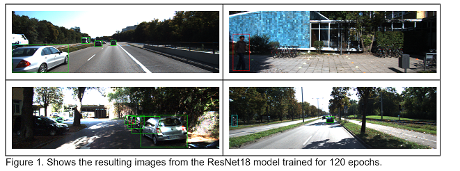
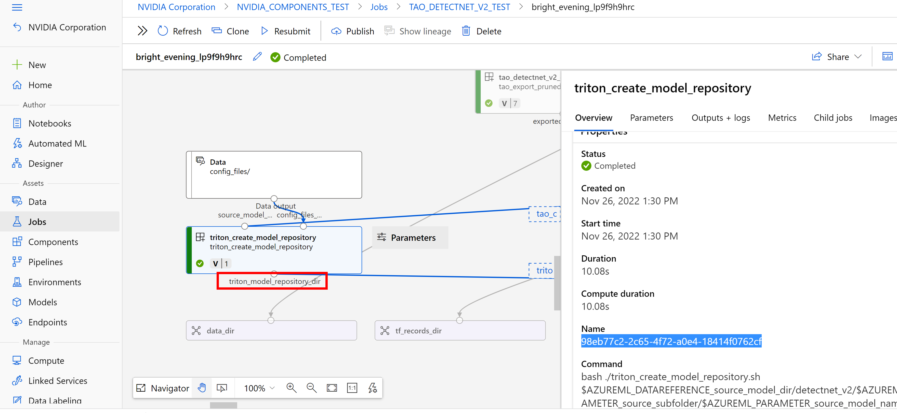

# Object Detection AzureML Pipeline using TAO DetectNet_v2 Components

This pipeline implements this [NGC Notebook](https://catalog.ngc.nvidia.com/orgs/nvidia/resources/tao_detectnet) 

## Object Detection Pipeline 

Object detection is a popular computer vision technique that can detect one or multiple objects in a frame and place bounding boxes around them. This sample pipeline provided here, contains a ResNet18 model that you can retrain on an AzureML Compute Cluster, simply by running this pipeline.

Some of the major steps covered in the notebook are, but not limited to: 
>	Setting the environment variables
>	Downloading and converting the training data
>	Downloading the model from the NGC catalog
>	Training the model
>	Pruning the model – this removes the unwanted layers, reducing the size of the model
>	Retraining the pruned model to recover the lost accuracy
>	Quantize Aware Training (QAT) that changes the precision of the model to INT8, reducing the size of the model, without sacrificing accuracy
>	Exporting the model for inference 

## Model Indentification and Registering
Pipelines contain end-to-end user cases that produce a model or a set of models as output, each pipeline has a folder deployment_scripts that has the scripts the user needs to run to deploy the model(s) into an AzureML Inference Endpoint

Once the pipeline job has been succesfully completed, the user can now deploy the produced models by following the deployment instructions

This pipeline produces a model that is set up to be deployed as an AzureML Triton Inference Endpoint

The user needs to identify the Job ID and Output name of the AzureML Component Job that produces the model, in this case:triton_create_model_repository

## Deploying the Model

In this section, we’ll take the exported model and deploy it in AzureML with NVIDIA Triton Inference Server™, an open-source inference serving software that helps standardize model deployment and execution and delivers fast and scalable AI in production.
We’ll first upload the model from the datastore, build and push the Triton container to the Azure Container Registry (ACR), create the inference end point and test it against using some sample images. 
In addition to the config files provided, there are also a few auxiliary scripts required to deploy the model. These files are included the zip file shown below: 
https://api.ngc.nvidia.com/v2/resources/nvidia/azureml_quick_launch_tao/versions/1/zip
Registering the Model
The last step of the DetectNet_v2 notebook stored the model, on the workspace default datastore, with the appropriate Triton folder structure

The next steps entail uploading the model for inference to AzureML. 
The model is uploaded from the datastore. Navigate to https://ml.azure.com to load the model.
1.	Launch the AzureML Studio for the AzureML Workspace provided to the NGC quick launch toolkit. Choose the “Models” tab and press the “Register” button and select the “from datastore” choice 
Figure 8. Upload the model from the datastore
 
2.	Select the `Triton` option when uploading the model and select workspaceblobstore as the datastore
Figure 9. Select Triton for model type and workspaceblobstore as the datastore from the pull-down menu
  
 
3.	Browse and select the path: tao/detectnet_v2/model_repository
 Figure 10. Select the tao/detectnet_v2/model_repository path 
 

4.	Name the model “DetectNet” and set version number to “1”
Figure 11. Naming the model “DetectNet”
 

5.	Once the model has successfully uploaded, you should be able to see the directory structure shown below in Figure 12.
Figure 12. Model successfully uploaded under artifacts
 
 
6.	To set up the libraries for inference stage, script set_inference_libraries.sh should be run
bash scripts/set_inference_libraries.sh
7.	Run the following script to create the Triton container with the necessary dependencies:
bash scripts/build_container.sh
8.	You can verify that the image has been created locally by executing docker image ls.
Figure 13. Triton container successfully created
 

### Uploading docker image to the Azure Container Registry (ACR)
The docker image we just built needs to be pushed into the Azure Container Registry. To do this, run the following script:
bash scripts/push_container_to_ACR.sh <registryname>
Parameter registryname is the name of the provided Azure ML Workspace default container registry. Navigate to the Workspace essential properties dashboard to find this in the Azure Portal.
Figure 14. Push the Triton container to the Azure Container Registry (ACR) using the registry name
 
 

>	The script first builds the image by running command: 
docker build -t ${registryname}.azurecr.io/tao -f Dockerfile_aml.yml 
>	The file called Dockerfile_aml.yml uses the image generated in the last step as base image. Contents of this file are as follows:
FROM nvcr.io/nvidia/tao/triton-apps:22.02-py3
EXPOSE 8000
CMD /opt/tritonserver/bin/tritonserver --model-store=/models/model_repository
>	The script then tags the images and pushes it to the ACR by running command:
docker push ${registryname}.azurecr.io/tao:latest	
Once the script completes, navigate to ACR to see the container in the `tao` repository.

### Creating the Azure ML Endpoint and Deployment
1.	Run the following script to create an Azure ML Endpoint followed by the deployment:
bash scripts/create_endpoint_and_deployment.sh
2.	The script first creates the Azure ML Endpoint by running command:
az ml online-endpoint create -f endpoint_aml.yml 
3.	File endpoint_aml.yml shown below contains the name of the Endpoint.
$schema: https://Azure MLschemas.azureedge.net/latest/managedOnlineEndpoint.schema.json
name: triton-tao-endpoint-aml-1
auth_mode: key
4.	The script then creates the deployment by running command:
az ml online-deployment create -f deployment_aml.yml 
5.	All the information needed to create the deployment is provided in file deployment_aml.yml. The file specifies the endpoint to use (triton-tao-endpoint-aml-1), the model uploaded on AML (DetectNet:1), the docker image uploaded to ACR (taodemomainregistry.azurecr.io/tao:latest). 
The file also provides the VM Size to be used for the deployment (Standard_NC6s_v3), which should have the same nature of GPUs (V100) as the ones used by the pipeline. The following are the full contents of the file.

$schema: https://Azure MLschemas.azureedge.net/latest/managedOnlineDeployment.schema.json
name: triton-tao-deployment-aml-1
endpoint_name: triton-tao-endpoint-aml-1
model: Azure ML:DetectNet:1
model_mount_path: /models 
environment: 
  name: triton-tao-env
  image: taodemomainregistry.azurecr.io/tao:latest
  inference_config:
      liveness_route:
          path: /v2/health/live
          port: 8000
      readiness_route:
          path: /v2/health/ready
          port: 8000
      scoring_route:
          path: /
          port: 8000
instance_type: Standard_NC6s_v3
request_settings:
  request_timeout_ms: 10000
  max_concurrent_requests_per_instance: 512
  max_queue_wait_ms: 3000
liveness_probe:
  initial_delay: 300
  timeout: 1
  period: 5
  success_threshold: 1
  failure_threshold: 20
readiness_probe:
  initial_delay: 300
  timeout: 1
  period: 5
  success_threshold: 1
  failure_threshold: 20
instance_count: 1
6.	Once the script completes executing, you should be able to see the inference endpoint and the deployment information on the Azure Portal. The deployment information can be found by clicking into the endpoint and navigating to the Deployment Logs Tab.
Figure 15. End points created in Azure ML
 

### Validating the Endpoint
You can validate the endpoint by using the REST endpoint URL found on the Consume Tab of the endpoint information on the Azure Portal. The primary key is another important parameter you’ll need when querying the Endpoint.
Figure 16. Validating the Endpoint
 

To query the Azure ML endpoint from the user local machine, run the following script:
.bash scripts/infer.sh triton-tao-endpoint-aml-1.southcentralus.inference.ml.azure.com dkz5FHV2R6EvgK86xgooduzY8GhMvBum ../scripts/ImageTest/Test.jpg ../scripts/ImageTest/Output
Notice that the REST endpoint URL (without the https://) is passed as the URL parameter -u and that the primary key (dkz5FHV2R6EvgK86xgooduzY8GhMvBum) is passed as the token parameter -t.
The endpoint is queried with image Test.jpg on folder ./scripts/ImageTest/Test.jpg. The output is stored in ./scripts/ImageTest//Output/infer_images/Test.jpg
Figure 17. Final output from the model after running a sample image
 

Summary
In this post, we showed you an end-to-end workflow of fine-tuning and deploying an object detention mode using the NVIDIA TAO Toolkit and NVIDIA Triton Inference Server, respectively. Both these tools abstract away the AI framework complexity, enabling you to build and deploy AI applications in production without the need for any AI expertise.

<pre style="background-color:rgba(0, 0, 0, 0.0470588)">source scripts/config_files/config.sh
cd $pipeline_path
</pre>
